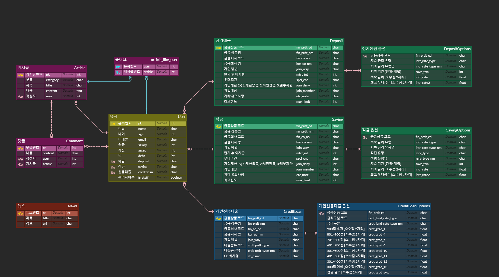

# 개요

- 진행기간 : 2024.05.08(수) ~ 2024.05.23(목)

- 주제 : 청년 창업을 위한 대출 금리 비교 및 추천 사이트

- 서비스명 : 범성

- 프론트 : vue - 성인

- 백 : django - 범준

 

## 컨셉

- 창업 커뮤니티
- 창업주들에게 발품파는 시간을 조금이라도 줄여주는 웹서비스

<aside>
✅ 금융감독원 데이터를 활용한 예적금, 대출 금리 비교 조회 서비스

</aside>

<aside>
💡 부동산 데이터를 활용한 임대료 및 권리금, 공실률 조회 서비스

</aside>

## 필수 기능

1. 예금&적금 금리 비교
2. 환율 계산기
3. 은행 검색(카카오맵)
4. 상품 추천
5. 회원 관리(로그인, 회원가입, 회원탈퇴, ...) - 카카오 oauth 로그인
6. 커뮤니티(게시판)
7. 프로필 페이지

## 일별 진행내용

|일자|내용|
|---|---|
|05-08|프로젝트 아이디어 구상|
|05-09|아이디어 구체화(필요 데이터 정리, 화면 구상) 및 ERD 작성|

## ERD

