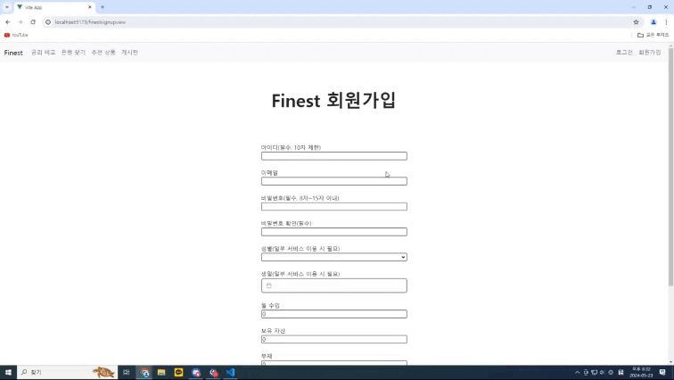

[🌏노션 링크](https://inky-marten-9ff.notion.site/Finest-2946ce6ba07942db88e13ac40a60de0f?pvs=4)

[🏷Figma 링크](https://www.figma.com/community/file/1375370963988360217/finest)

# Finest
SSAFY 11기 1학기 관통 프로젝트

 

## I. ✨ 프로젝트 개요

🗓️ 진행기간 : 2024.05.08(수) ~ 2024.05.23(목)

👑 서비스명 : Finest

🎯 주제 : 창업자들을 위한 커뮤니티 사이트

🌃 컨셉 및 기획의도

- 창업 커뮤니티로써 다양한 관련 정보들을 제공합니다.
- 회원 간 창업 관련 주요 정보 공유, 금융 관련 정보 공유를 권장합니다. 
- 창업지원 혹은 사업자지원 관련 주요 웹사이트는 10개 이상입니다. 이 모든 웹사이트들을 사업주가 일일이 찾아보기는 힘들것이라고 예상됩니다. 저희 Finest는 예비창업자 혹은 사업자분들이 발품파는 시간을 조금이라도 줄여주고자 합니다.
- ✅ 금융감독원 데이터를 활용한 예적금, 대출 금리 비교 조회 서비스 제공

- 💡 부동산 데이터를 활용한 임대료 및 권리금, 공실률 조회 서비스 제공

 

## II. 👨‍👩‍👧‍👦 팀원 정보 및 업무 분담

<table>
  <tr>
    <td align="center" style="border: 1px solid #ccc;">
       
      

      <a href="https://github.com/qwert0175">조성인</a>
    </td>
    <td align="center" style="border: 1px solid #ccc;">
       
      

      <a href="https://github.com/BigBeom" >박범준</a>
    </td>
  </tr>
</table>

 

👥 조성인
- Backend 
  - 환율 API 작성
    - 환율정보 DB 저장 및 조회
  - 금융상품 API 작성
    - 금융상품 정보 DB 저장 및 조회
  - 상품 추천 알고리즘 작성
    - 사용자의 동일 연령대, 성별의 사람들이 많이 가입한 상품 표시

- Frontend
  - 메인 페이지 작성
  - 프로필 페이지 작성
    - 사용자 기본 정보
    - 가입 상품 금리 그래프
  - 환율계산기 기능 구현
  - 예적금 금리비교 페이지
    - 은행, 기간별 필터링
    - 기간별 금리순 정렬
  - 금융상품 상세보기 페이지 작성
    - 예적금 가입/탈퇴 처리 구현
  - 카카오지도 페이지 작성
    - 주변은행 찾기
    - 은행검색 기능
  - 추천상품 페이지 제작

- ETC
  - 최종 발표 프레젠테이션 검토 및 발표
  - ERD 설계 / DB 스키마 생성 및 수정

 

👥 박범준
- Backend
  - User API 작성
    - 커스터마이징 회원 가입 / 로그인 / 로그아웃
  - Board API 작성 
    - CRUD / 댓글 등록

- Frontend
  - 메인페이지 수정 및 보완
  - 프로필 페이지 수정 및 보완
  - 게시판 관련 페이지 작성
    - CRUD 페이지 작성
    - 커뮤니티 페이지 작성

- ETC
  - Notion, Readme 문서 작성 총괄
  - Figma 디자인 총괄
  - DB 스키마 생성 및 수정
  - 최종 발표 프레젠테이션 제작 및 수정 보완

 

## III. 👩‍💻 일별 진행내용
|일자|내용|
|---|---|
|05-08|프로젝트 아이디어 구상|
|05-09|아이디어 구체화(필요 데이터 정리, 화면 구상) 및 ERD 작성|
|05-13|카카오맵 api를 사용한 은행 찾기 기능 구현|
|05-14|화면 목업 작성 및 홈페이지 이벤트 배너 추가, 지도 페이지 기능 구현|
|05-15|목업 업데이트 및 환율 정보 DB 저장, 환율 계산기 기능 구현|
|05-16|환율 계산기 편의성, 환율정보 저장 기능 업데이트 및 회원가입 기능 구현|
|05-17|회원가입 기능 수정, 지도 검색 기능 추가|
|05-18|금융 상품 정보 가져오기, 게시판CRUD 구현|
|05-19|예적금 금리 비교 페이지 생성, models 및 serializer 수정, 회원가입 이슈해결|
|05-20|로그인, 로그아웃, 회원정보수정 화면 구현|
|05-21|게시판 CR 화면 구현, 회원탈퇴 기능 구현|
|05-22|게시글 CRUD 디자인 및 댓글 CRUD 구현 완료, 커뮤니티 및 메인페이지 디자인 수정 |
|05-23|프로젝트 디버깅, 정리 및 최종 발표 준비|

 

## IV. 💎 설계 내용 및 실제 구현 정도
 <table>
  <thead>
    <tr>
      <th>기능</th>
      <th>아쉬운점</th>
      <th>구현정도</th>
    </tr>
  </thead>
  <tbody>
    <tr>
      <td>메인 페이지</td>
      <td>배너 바로가기 링크</td>
      <td>⭐⭐⭐⭐</td>
    </tr>
    <tr style="background-color: #999;">
      <td>회원 커스터마이징</td>
      <td>비밀번호 변경, username과 nickname 분리</td>
      <td>⭐⭐⭐⭐</td>
    </tr>
    <tr>
      <td>예적금 금리 비교</td>
      <td>디자인</td>
      <td>⭐⭐⭐⭐⭐</td>
    </tr>
    <tr style="background-color: #999;">
      <td>환율 계산기</td>
      <td>국기 이미지</td>
      <td>⭐⭐⭐⭐⭐</td>
    </tr>
    <tr>
      <td>근처 은행 검색 (카카오맵)</td>
      <td>내위치 표시, infowindow ui</td>
      <td>⭐⭐⭐⭐</td>
    </tr>
    <tr style="background-color: #999;">
      <td>커뮤니티(게시판)</td>
      <td>카테고리별 페이지, 특정 게시글 상단 고정, Pagination</td>
      <td>⭐⭐⭐</td>
    </tr>
    <tr>
      <td>프로필 페이지</td>
      <td>프로필 이미지, 디자인</td>
      <td>⭐⭐⭐⭐</td>
    </tr>
    <tr style="background-color: #999;">
      <td>금융 상품 추천 알고리즘</td>
      <td>창의성</td>
      <td>⭐⭐⭐⭐</td>
    </tr>
        <tr>
      <td>임대료, 권리금, 공실률 조회 서비스</td>
      <td></td>
      <td>미구현</td>
    </tr>
  </tbody>
</table>

 

## V. 🔑 ERD

 

## VI. 📑 금융 상품 추천 알고리즘 설명
- 사용자와 같은 성별, 연령대에 해당하는 사람들이 가장 많이 가입한 상품 5개를 추천
- 사용자가 가입한 상품은 제외

 

## VII. 📑 서비스 대표 기능들 설명

### 1. 회원: 회원가입(아디 비번만 작성) / 로그인 / 로그아웃 

 

### 2. 회원정보변경 : 수정 / 회원탈퇴

 

### 3. 예적금 금리비교 : 예적금 금리순 정렬 / 은행 필터링

 

### 4. 상품 상세 조회 : 상품가입(개월별 가능) / 적금 디테일 / 탈퇴하기

 

### 5. 프로필 페이지 : 유저정보 / 내가 가입한 금융 상품 리스트 출력

 

### 6. 금융 상품 추천 : 알고리즘(상품별 가입자 수)에 따라 추천 상품 리스트 출력 / 추천상품에서 가입(추천상품 목록에서 상품 사라짐)

 

### 7. 환율 계산기 : 양방향 환율 계산

 

### 8. 은행 및 지도 검색 : 현재위치 주변은행 표시(은행클릭) & 드래그하면서 위치 탐색 / 위치 검색 / 장소 선택 시 정보 출력 / 확대해서 보다가 왼쪽 지도 리스트 버튼 클릭하면 그곳으로 이동

 

### 9. 게시글 검색 및 작성 : 게시글 검색 / 글쓰기 / 게시글 클릭 해서 상세페이지 들어가기

 

### 10. 게시글 상세 : 수정&삭제(본인만 가능) / 댓글 생성 및 삭제(본인만 가능)

 

## 📝 느낀점

### 조성인
- 이번 마지막 프로젝트를 통해 1학기 동안 배운 Vue와 Django의 내용을 전반적으로 복습할 수 있었습니다. 최종 프로젝트에서는 프론트엔드와 백엔드를 구분하여 진행했는데, 이 둘을 연결하는 과정이 특히 어려웠습니다. 또한, 단순히 기능 구현에 그치지 않고 사용자 관점에서 어떻게 하면 더 편리하게 사용할 수 있을지 고민했습니다. 협업을 통해 디자인, 금융 정보 등 제가 부족했던 부분들을 보완할 수 있어 매우 유익한 경험이었습니다. 그러나 아쉬운 점도 있었습니다. 프로젝트가 필수 기능 구현에만 그쳤고, 차별화된 개별 기능을 추가하지 못한 것이 아쉽습니다.

### 박범준
BACK
- 회원가입 커스터마이징을 할 때  int object is not subscriptable"이라는 오류 메시지가 자주 발생하였습니다. 대괄호를 사용하여 정수 요소에 액세스하려고 할 때 발생하는 오류였고 model과 serializer에서 print를 찍어도 보았지만 문제점을 찾지 못하였습니다. 그러던 중 모듈에 adapter 파일에서 모듈에 없는 함수를 import해서 사용하려다가 에러가 발생한 것을 알 수 있었습니다. print를 찍어보며 결과값을 타고 올라가 확인해보는것도 좋지만 보다 근본적인곳에 문제가 있었음을 깨달았습니다.

 

FRONT
- 게시글에서 댓글 작성을 구현할때 페이지를 랜더링하는 흐름에 대해서 이해할 수 있었습니다. 제가 작성한 코드는 vue에서 새 댓글을 등록하는 함수가 호출될때 store의 js파일에서 새 댓글을 만드는 함수를 트리거합니다. 그동안 await는 promise가 해결될때까지 실행을 일지중지합니다. 그 후 해결이되면 새 댓글이 등록되었다는 것이고 댓글 목록을 가져오면서 await가 또다시 그 다음으로의 실행을 중지시킵니다. 이마저도 해결되면 마지막으로 입력 필드를 초기화 하면서 댓글 작성이 마무리됩니다. 
- 강의를 들으며 실습문제를 풀때와는 달리 직접 프로젝트를 하면서 많은 vue 파일들으 다뤘고 이러한 비동기 처리의 흐름에 대해서 이해할 수 있었습니다. 

 

마무리
- 혼자였으면 못했을 프로젝트를 마무리해서 뿌듯합니다!! 싸피에서의 1학기때 과정을 복습하며 기술스택들을 되돌아볼수 있어서 좋았습니다. 하지만 외부api에서 데이터를 가져오고 가공하는데 부족한점을 많이 느꼇고 2학기가 시작되기 전까지 부족한점을 보완할 것입니다.

 

## 🛠 기술 스택

### Backend

### Frontend

### Database

### Commnunication

 

<!-- ## 📁 폴더 구조

[ BACK-END ]

[ FRONT-END ]

 

 -->